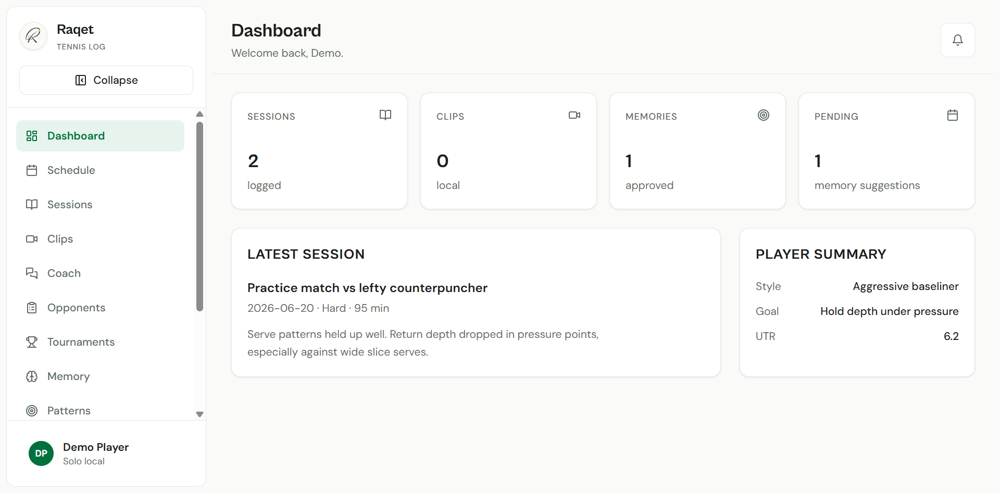
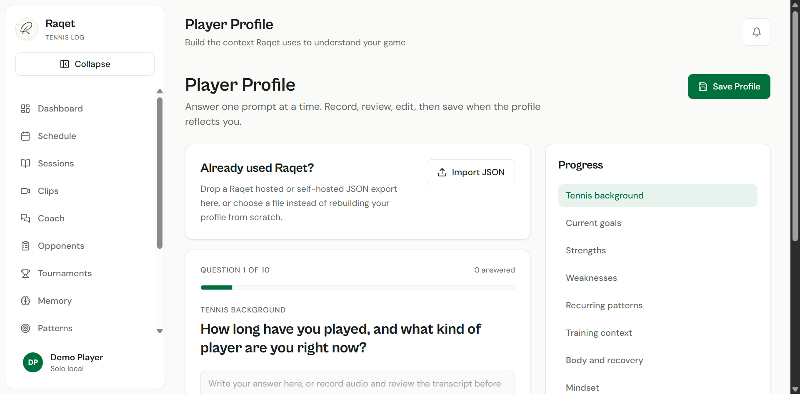
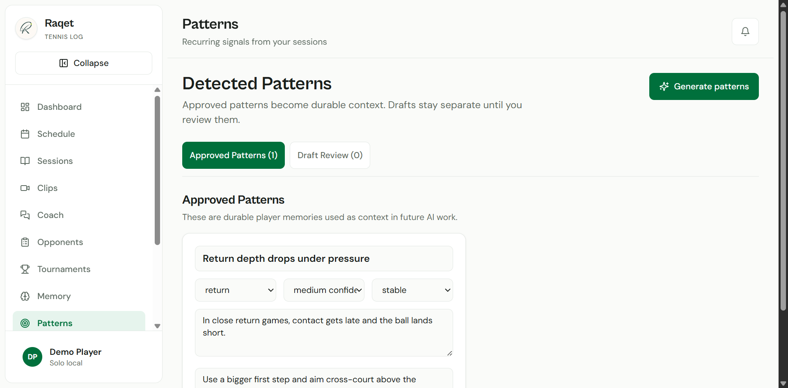
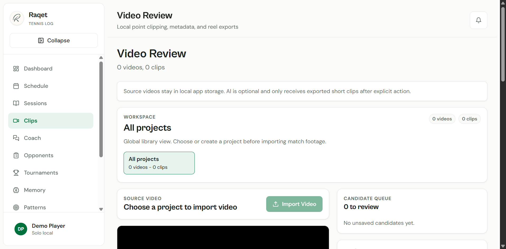

# Raqet

Raqet is a self-hostable solo tennis journal and video review app for one player.

The open-source baseline is local-first:

- SQLite persistence by default.
- No hosted auth, invite gate, Sentry, Vercel Analytics, Supabase project, managed usage limit, billing system, or Raqet-hosted AI proxy required.
- Local player profile onboarding, sessions, opponents, tournaments, stats, memories, settings, JSON import/export, privacy/terms pages, patterns, and training blocks.
- Local video library with source video storage, point clipping, ffmpeg clip export, batch highlight export, and 9:16 reel export.
- Optional bring-your-own external AI endpoint for AI actions.

Teams, coach roster workflows, hosted beta invites, hosted analytics/monitoring, and managed usage limits are excluded from the default self-hosted solo release.

## Screenshots









## Requirements

- Node.js 22 or newer. Raqet uses Node's built-in SQLite module.
- npm.
- Optional: `ffmpeg` and `ffprobe` on `PATH` for video duration probing and clip/reel export.
- Optional: an external AI endpoint if you want the built-in AI actions.

## Quick Start

If you use an AI coding assistant, the easiest path is to copy this repository link into your AI and ask it to install it:

```text
https://github.com/juansuero/raqet
```

Tell it: "Install this repo locally, run the setup commands, and start the app."

Manual setup:

1. Install dependencies:

```powershell
npm.cmd install
```

2. Initialize SQLite:

```powershell
npm.cmd run db:init
```

By default this creates `data/raqet.sqlite`. To use a different database path:

```powershell
$env:RAQET_DB_PATH="C:/tmp/raqet.sqlite"
npm.cmd run db:init
```

3. Start development:

```powershell
npm.cmd run dev
```

Open `http://localhost:3000/dashboard`. `/login` redirects into the solo app because local auth is not required.

4. Production build:

```powershell
npm.cmd run build
npm.cmd run start
```

The production build intentionally uses webpack through the `build` script. Use the scripts in `package.json` instead of calling `next build` directly.

## Configuration

Copy `.env.example` to `.env` only when you need to override defaults. The app starts without cloud credentials.

```env
RAQET_DB_PATH=
RAQET_VIDEO_STORAGE_PATH=
FFMPEG_PATH=
FFPROBE_PATH=
RAQET_AI_DISABLED=false
RAQET_AI_API_KEY=
RAQET_AI_BASE_URL=
RAQET_AI_MODEL=
RAQET_AI_TRANSCRIPTION_MODEL=
RAQET_AI_VIDEO_ENDPOINT=
RAQET_AI_VIDEO_MODEL=
RAQET_SOLO_EMAIL=player@localhost
RAQET_SOLO_NAME=Player
```

See [docs/CONFIGURATION.md](docs/CONFIGURATION.md) for details.

## Import From Hosted Raqet

Hosted and self-hosted Raqet exports are JSON files.

1. In the hosted app, use **Export Data** or open `/api/export`. The response downloads as `raqet-export-YYYY-MM-DD.json`.
2. Start the self-hosted app.
3. Open `/onboarding` or `/settings`.
4. Drag the JSON file into the **Import JSON** box, or choose it with the file picker.
5. Review the import summary. Records are merged by ID, so existing records with the same IDs are updated.

Imported data includes profile, sessions, opponents, tournaments, tournament matches, memories, coach messages, rating history, projects, clips, patterns, training blocks, and session training block links. Local source video files are not embedded in JSON exports; back them up separately.

See [docs/IMPORT_EXPORT.md](docs/IMPORT_EXPORT.md).

## Optional AI

AI is optional. Journaling, manual video review, stats, memories, settings, import, and export work without an AI endpoint.

The environment variables below matter only when you want Raqet's built-in AI features. Raqet uses a provider-agnostic HTTP adapter, so you can point it at any service, local gateway, proxy, or workflow that exposes a compatible contract.

Minimum text setup:

```env
RAQET_AI_API_KEY=your-key
RAQET_AI_BASE_URL=https://your-ai-endpoint.example/v1
RAQET_AI_MODEL=your-text-model
```

Optional voice transcription:

```env
RAQET_AI_TRANSCRIPTION_MODEL=your-transcription-model
```

Optional selected clip video analysis:

```env
RAQET_AI_VIDEO_ENDPOINT=https://your-ai-endpoint.example/video/analyze
RAQET_AI_VIDEO_MODEL=your-video-model
```

Text generation defaults to `${RAQET_AI_BASE_URL}/chat/completions`. Transcription defaults to `${RAQET_AI_BASE_URL}/audio/transcriptions`. You can override either with `RAQET_AI_TEXT_ENDPOINT` or `RAQET_AI_TRANSCRIPTION_ENDPOINT`.

Set `RAQET_AI_DISABLED=true` to force the no-endpoint path even if keys exist in your shell or `.env`.

External AI endpoint costs are the self-hoster's responsibility. Raqet does not include billing, hosted usage limits, or managed Raqet AI infrastructure.

AI actions disclose what is sent. Source full-match videos are never uploaded automatically. Selected video AI sends an exported short clip only after explicit user action.

## Video Storage

Raqet copies uploaded videos into local app storage because browsers cannot safely play arbitrary filesystem paths.

Defaults:

- Source videos: `data/video-library/sources`
- Exported point clips: `data/video-library/exports/clips`
- Exported 9:16 reels: `data/video-library/exports/reels`
- Metadata: `data/raqet.sqlite`, or `RAQET_DB_PATH`

Override video storage with `RAQET_VIDEO_STORAGE_PATH`.

Deleting a clip in the app deletes clip metadata only. It does not delete source video files or exported media files unless a future explicit destructive action says so.

## Backup And Restore

Stop the app before copying live data.

Backup:

```powershell
Copy-Item data/raqet.sqlite C:/backups/raqet.sqlite
Copy-Item data/video-library C:/backups/video-library -Recurse
```

Restore:

```powershell
Copy-Item C:/backups/raqet.sqlite data/raqet.sqlite
Copy-Item C:/backups/video-library data/video-library -Recurse
```

If you use custom paths, back up `RAQET_DB_PATH` and `RAQET_VIDEO_STORAGE_PATH` instead.

## Verification

```powershell
npm.cmd run typecheck
npm.cmd run build
```

Browser smoke checklist:

- `/onboarding` saves a local player profile and imports a JSON export by picker or drag-and-drop.
- `/dashboard` loads without hosted env vars.
- `/sessions`, `/sessions/new`, and session detail pages use SQLite-backed records.
- `/opponents`, `/tournaments`, `/stats`, `/memory`, `/patterns`, `/training-plan`, `/settings`, and `/api/export` load.
- `/clips` imports a local video, plays it, marks point start/end, saves point metadata, exports a standard clip, and exports a 9:16 reel.
- `/settings` shows AI endpoint status without exposing API keys.
- `/team` and `/api/team` return 404 and Team is absent from normal navigation.

## Troubleshooting

`SQLite is an experimental feature`

Node currently marks the built-in SQLite module experimental. The production build should be clean, but `db:init` or runtime database access may still print this Node warning. Use Node 22+.

`ffmpeg was not found`

Install ffmpeg and ffprobe, add them to `PATH`, or set `FFMPEG_PATH` and `FFPROBE_PATH`. Metadata still saves without ffmpeg; exports require it.

AI endpoint missing

Leave AI disabled for local-only use, or configure `RAQET_AI_API_KEY`, `RAQET_AI_BASE_URL`, and `RAQET_AI_MODEL`. Do not commit `.env`.

Team routes

The self-hosted release excludes Team source routes. `/team` and `/api/team` are blocked by middleware and should return 404.

## GitHub Release Docs

- [docs/INSTALLATION.md](docs/INSTALLATION.md)
- [docs/CONFIGURATION.md](docs/CONFIGURATION.md)
- [docs/IMPORT_EXPORT.md](docs/IMPORT_EXPORT.md)
- [CHANGELOG.md](CHANGELOG.md)
- [CONTRIBUTING.md](CONTRIBUTING.md)
- [SECURITY.md](SECURITY.md)
- [SUPPORT.md](SUPPORT.md)
- [PRIVACY.md](PRIVACY.md)

## Privacy

Read [PRIVACY.md](PRIVACY.md). In short: local journal data and videos stay on the self-hoster's machine by default. External AI calls happen only when the self-hoster configures an endpoint and triggers an AI action.

## License

Raqet is released under the MIT License. See [LICENSE](LICENSE).
